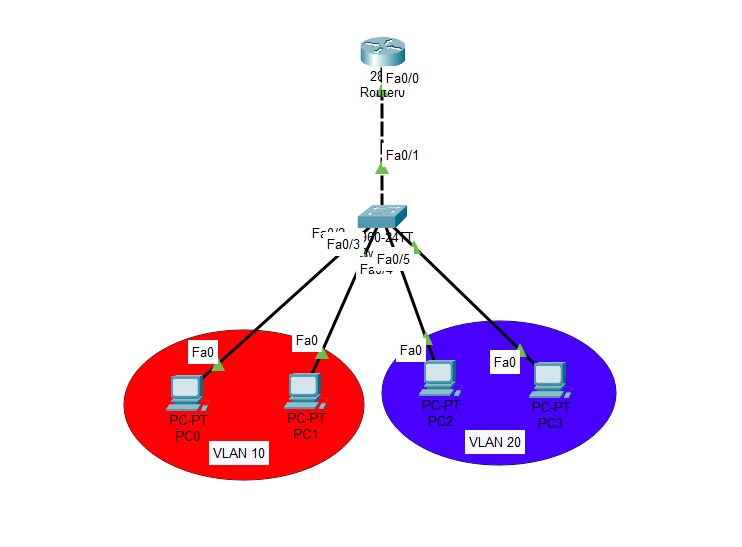

## 🌐 CCNA Network Project: LAN with VLANs & Routing 🚀
A sleek Cisco Packet Tracer project showcasing core CCNA concepts: VLANs, Inter-VLAN Routing, and ACLs. Perfect for learning Cisco networking! 🖥️

---

## 🎯 Features

🏢 VLAN Setup: Two VLANs (Sales: VLAN 10, IT: VLAN 20).
🔄 Inter-VLAN Routing: Router-on-a-stick configuration.
🔒 Access Control: ACLs to restrict traffic between VLANs.
✅ Testing: Verify connectivity with Ping and Packet Tracer simulation.

---

## 🖼️ Photos And Info

  

## Devices:
1 Router (Cisco 2811) 🖧
1 Switch (Cisco 2950-24) 🔌
4 PCs (2 per VLAN) 💻

Connections: Trunk link between switch and router 🌉

IP Plan:

VLAN 10 (Sales): 192.168.10.0/24
VLAN 20 (IT): 192.168.20.0/24

Devices:

1 Router (Cisco 2811) 🖧
1 Switch (Cisco 2950-24) 🔌
4 PCs (2 per VLAN) 💻

Connections: Trunk link between switch and router 🌉
IP Plan:

VLAN 10 (Sales): 192.168.10.0/24
VLAN 20 (IT): 192.168.20.0/24

## 📋 Requirements

Cisco Packet Tracer (v8.2+) 🛠️
Git (to clone repo) 📥
Text editor for Markdown (e.g., VS Code) 📝

## 🚀 Quick Start

Open network.pkt in Packet Tracer.
Review configurations.txt for setups.

## ⚙️ Configuration Files

network.pkt: Packet Tracer file 📂
photo.jpg: Topology diagram 🖼️
switch_config.txt: Switch configs 📜
router_config.txt: Router configs 📜

## 🧪 Testing

Ping:
PC1 (VLAN 10) → PC2 (VLAN 10): ✅ Success
PC1 → PC3 (VLAN 20): 🚫 Blocked by ACL
PC3 → PC1: ✅ Success

## Verify:
Switch: show vlan brief 📋
Router: show ip route 🗺️
Router: show access-lists 🔒

Use Packet Tracer’s Simulation Mode to trace packets. 🔍

## 💡 Motivation
"Take the leap and build your skills—your network, your rules!" 🌟

## 👨‍💻 Author
Created by **HeidarAli** – Future CCNP & DevNet Pro! 🌐

## 📜 License
MIT License 📄

🌟 Thanks for checking out this project! Questions? Open an issue! 😊
